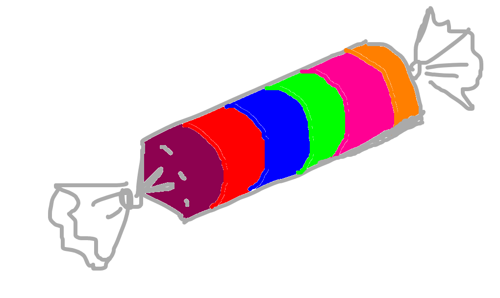

# Goma IoT

**IoT automation system for device and data management**



***A sweet glue candy for a dark Eclipse IoT Ecossystem***

**Description:**

Goma IoT is a comprehensive system for managing and automating IoT devices. The name Goma IoT comes from the idea to integrate the solutions, create a script to manage this solutions and bring a out of the box ecossystem to put IoT and Machine Learning anomaly detections in productions with simple steps. It allows you to:

* Connect and monitor your IoT devices
* Collect and store sensor data
* Create rules and automations to trigger devices based on sensor data
* Visualize real-time and historical sensor data
* Receive alerts about important events and anomalys

**Features:**

* Support MQTT and REST IoT communication protocols
* Intuitive web interface for managing devices and visualizing data
* Visual rule editor to create complex automations
* Support NoSQL database
* Email, Webhook and SMS alerts
* RESTful API for integration with other systems
* Codes and eletronical projects for ESP8266
* Scripts to deploy arduino codes to your ESP8266
* Tutorials and documentation to get log, and debug the principal components ( Grafana, Kapua, Kura, OpenSearch )

**Installation:**

**Prerequisites FOG / Gateway :**

* Raspberry 3B+ or Higher
* SO: Raspberry 64bits ARM
* Internet connection configured

**Prerequisites Cloud Server :**

* STORAGE: 50GB
* CPU: 2Ghz
* Memory: 16GB RAM
* SO: Ubuntu 22 LTS
* Internet connection configured


**Steps:**

1. Clone the repository:

```
git clone https://github.com/mathiasbrem/goma-iot.git
```

2. Navigate into the project directory:

```
cd goma-iot
```

3. Install Cloud Environment ( Over the Cloud Server ):

```
sudo sh goma_iot.sh install cloud
```

3. Install Gateway Environment ( Over the FOG / Gateway Server ):

```
sudo sh goma_iot.sh install gateway
```

4. Run the server:

* Cloud Server:
```
sudo sh goma_iot.sh cloud start // start
sudo sh goma_iot.sh cloud stop // stop
sudo sh goma_iot.sh cloud restart // restart
sudo sh goma_iot.sh cloud status // status
```

* FOG / Gateway Server:
```
sudo sh goma_iot.sh gateway start // start
sudo sh goma_iot.sh gateway stop // stop
sudo sh goma_iot.sh gateway restart // restart
sudo sh goma_iot.sh gateway status // status
```

**Usage:**

**Cloud Side:**

- Access the web interface at http://ip-of-your-server:8080 to start managing your IoT Gateways.

- Access the web interface at http://ip-of-your-server:3000 to start dashboard to visualize your data.

- Access the web interface at http://ip-of-your-server:5601 to start managing your datastore and manage your indices and machine learinng detectors.

**FOG / Gateway Side:**

- Access the web interface at https://ip-of-your-gateway to start managing your IoT Devices..

**License:**

Eclipse Public License - v 2.0

# Documentation:

- Install the cloud server
- Configure the cloud server
- Install the gateway
- Configure the cloud server
- Building the sensor devices
- Connect the sensor device to the gateway
- Connect the gateway to the cloud server
- Configure the anomaly detection sensor
- Building the dashboard

# References

- [The Eclipse Kura Documentation](https://eclipse.github.io/kura/docs-release-5.4/)
- [The Eclipse Kapua Documentation](https://github.com/eclipse/kapua/blob/develop/README.md)
- [The OpenSearch Documentation](https://opensearch.org/docs/latest/)
- [The Grafana Documentation](https://grafana.com/docs/grafana-cloud/monitor-infrastructure/integrations/integration-reference/integration-opensearch/)


**License:**

Eclipse Public License - v 2.0

